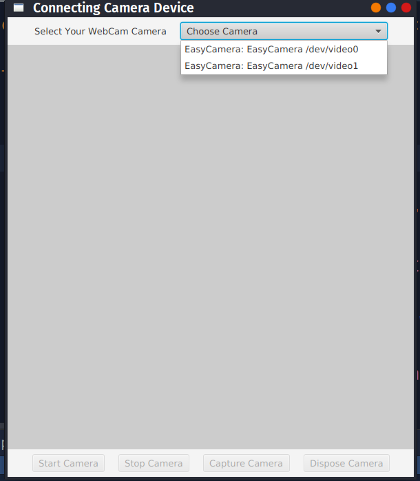
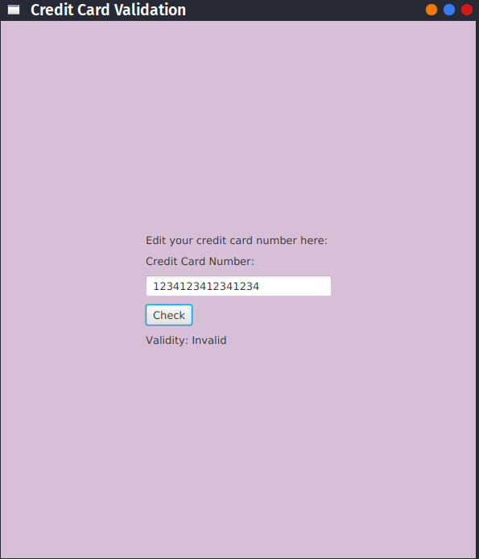

[]()
[](https://github.com/vijethph/credit-card-validation/issues)
[](https://github.com/vijethph/credit-card-validation/graphs/contributors)
[](https://github.com/vijethph/credit-card-validation/network)
[](https://github.com/vijethph/credit-card-validation/stargazers)
[](https://github.com/vijethph/credit-card-validation/blob/master/LICENSE)
[](https://forthebadge.com)
[](https://forthebadge.com)

<br />
<p align="center">
  <a href="https://github.com/vijethph/credit-card-validation">
    
  </a>

  <h2 align="center">Credit Card Validation</h2>

  <p align="center">
    A JavaFX program that captures credit card image from webcam, parse the numbers using Tesseract OCR, and uses it to determine the validity of credit card number.
    <br />
    <br />
    <a href="https://github.com/vijethph/credit-card-validation/issues">Report Bug</a>
    ·
    <a href="https://github.com/vijethph/credit-card-validation/issues">Request Feature</a>
  </p>
</p>


<!-- TABLE OF CONTENTS -->
## Table of Contents

* [About the Project](#about-the-project)
  * [Built With](#built-with)
* [Getting Started](#getting-started)
  * [Prerequisites](#prerequisites)
  * [Installation](#installation)
* [Usage](#usage)
* [Contributing](#contributing)
* [License](#license)
* [Contact](#contact)
* [Acknowledgements](#acknowledgements)


<!-- ABOUT THE PROJECT -->
## About The Project

[](screenshot1.png)
[](screenshot2.png)

This is a JavaFX program that uses [Sarxos Webcam Capture API](https://github.com/sarxos/webcam-capture) and [Tesseract OCR Engine](https://github.com/tesseract-ocr/tesseract) to capture credit card image using webcam, parse the numbers in it, and then check the validity of these credit card numbers. It employs an implementation of [Luhn's Algorithm](https://wikipedia.org/wiki/Luhn_algorithm) to validate the credit card numbers.


### Built With
This project is entirely built with the following components and languages:
* [JavaFX](https://openjfx.io)
* [Sarxos Webcam Capture API](https://github.com/sarxos/webcam-capture)
* [Tesseract OCR Engine](https://github.com/tesseract-ocr/tesseract)
* [JavaCPP Presets](https://github.com/bytedeco/javacpp-presets)


<!-- GETTING STARTED -->
## Getting Started

To get a local copy of the program up and running follow these simple steps.

### Prerequisites

Java Runtime Environment(JRE)>=8 and Apache Maven should be installed. After installation, check their versions using

```sh
java --version
mvn --version
```


### Installation

1. Clone the repo
```sh
git clone https://github.com/vijethph/credit-card-validation.git
```
2. Open the downloaded folder
```sh
cd credit-card-validation
```
3. Install the packages required using the following command:
```sh
mvn clean install
```
4. Finally run the program using
```sh
mvn exec:java -Dexec.mainClass="WebcamAppLauncher"
```
You can also download the jar file in [Releases](https://github.com/vijethph/credit-card-validation/releases) section and run it by using:
```sh
java pkg.jar
```


<!-- USAGE EXAMPLES -->
## Usage

Once the application starts, perform the following steps:

1. Select one of the available webcams in the dropdown list.
2. Capture the image of credit card with its numbers properly displayed.
3. Click "Perform OCR" to parse the digits.
4. You can edit the number in case of an error, and check validity of credit card number.


<!-- CONTRIBUTING -->
## Contributing [](https://github.com/vijethph/credit-card-validation/pulls)


Contributions are what make the open source community such an amazing place to be learn, inspire, and create. Any contributions you make are **greatly appreciated**.

1. Fork the Project
2. Create your Feature Branch (`git checkout -b feature/AmazingFeature`)
3. Commit your Changes (`git commit -m 'Add some AmazingFeature'`)
4. Push to the Branch (`git push origin feature/AmazingFeature`)
5. Open a Pull Request


<!-- LICENSE -->
## License

Distributed under the GNU GPL License.


<!-- CONTACT -->
## Contact

Vijeth P H - [@vijethph](https://github.com/vijethph)

Project Link: [https://github.com/vijethph/credit-card-validation](https://github.com/vijethph/credit-card-validation)

## Thank You!
[](https://forthebadge.com)

If you like this project, please ⭐ this repo and share it with others 👍


<!-- ACKNOWLEDGEMENTS -->
## Acknowledgements
* [JavaFX Docs](https://docs.oracle.com/javafx)
* [Img Shields](https://shields.io)
* [Choose an Open Source License](https://choosealicense.com)
* [Tesseract OCR Docs](https://tesseract-ocr.github.io/tessdoc)

